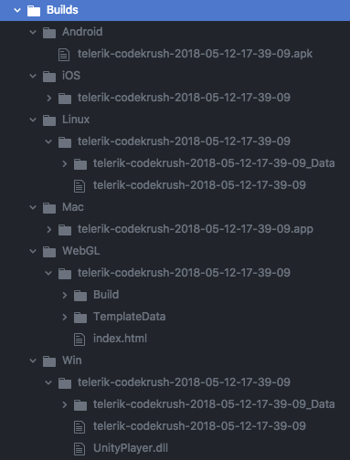

# Unity Multi Build Script
v 0.1.0

Create builds from the terminal for:

- Android
- iOS
- Linux
- Mac
- WebGL
- Windows
- (or all of the above in a batch!)

All with one terminal command: `./build All path/to/project`



## Setup

** Do not have the project open in Unity, or the same copy of Unity you are using to run the script open or the script will not work **

Change the `/path/to/unity` on line 3 of `build.sh` to the correct path for your situation.

Example for Mac:
```
/Applications/Unity/UnityBuilds.app/Contents/MacOS/Unity
```

Copy the `Assets/Editor/Build.cs` to `Assets/Editor/` in your Unity project.

Run the build.sh script and give it the platform you desire to build as the first parameter and the directory your Unity project is in as the second parameter.


## Platforms

- Android
  - `./build Android path/to/project`
- iOS
  - `./build iOS path/to/project`
- Linux
  - `./build Linux path/to/project`
- Mac
  - `./build Mac path/to/project`
- WebGL
  - `./build WebGL path/to/project`
- Windows
  - `./build Windows path/to/project`
- All 6
  - `./build All path/to/project`


## Caveats

1. Unity cannot be running when the script is started
2. If you have multiple copies of Unity on your computer none of them can have the project you are attempting to build open

## Contributing

Please do not hesitate to submit pull requests, I would love this to be a community effort.
Check the [Github issues](https://github.com/TwoScoopGames/Unity-Build-Scripts/issues) for ways to help that I already have on my radar, but here are a few important issues:

## Help wanted

- Fixes or possible solutions to caveats 1 & 2.
- Graceful fail / nice errors for common possible mistakes.
- Windows - some way to run this on Windows would be great and make it cross platform!
- Additional Platforms?
- Way to have Android and iOS builds go to an attached phone/tablet via a terminal command.


## Versioning

[SemVer](https://semver.org/) see [CHANGELOG.md](CHANELOG.md).

## Authors

* **[Alex Bezuska](https://github.com/alexbezuska)** - *Initial work*
* Shout out to [Allen](https://github.com/ambocclusion) for a lot of in-person help on the project and his existing build script [unity-build-copier](https://github.com/ambocclusion/unity-build-copier)


See also the list of [contributors](https://github.com/TwoScoopGames/Unity-Build-Scripts/contributors) who participated in this project.

## License

This project is licensed under the MIT License - see the [LICENSE](LICENSE) file for details
